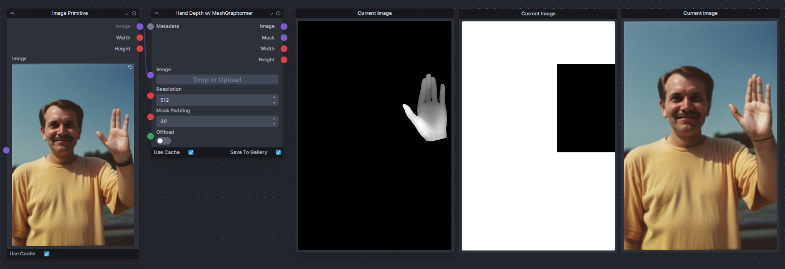

# Hand Refiner w/ MeshGraphormer for InvokeAI

A quick implementation of hand refining with Microsoft's Meshgraphormer for InvokeAI.



# Installation

Go to your `nodes` folder in your `root` directory and clone this repo

```
git clone https://github.com/blessedcoolant/invoke_meshgraphormer.git
```

You might have to manually install a couple of extra dependencies in your Invoke `venv`.

```
pip install trimesh rtree yacs
```

#### Models

The required models will be automatically downloaded to your `root` directory.

If you need to manually download the models, you can get them here from Microsoft and place them in your `INVOKE_ROOT/models/any/annotators/mesh_graphormer`. Do not rename the files.

- `graphormer_hand_state_dict.bin` - [Download](https://datarelease.blob.core.windows.net/metro/models/graphormer_hand_state_dict.bin)
- `hrnetv2_w64_imagenet_pretrained.pth` - [Download](https://datarelease.blob.core.windows.net/metro/models/hrnetv2_w64_imagenet_pretrained.pth)

# Usage

This extension consists of one node - `Hand Depth w/ MeshGraphormer`.

#### Inputs:

- Image: `PIL.Image` - Any image with hands in it
- Resolution: `int` - The size of the depth map to be generated
- Mask Padding: `int` - The size of the padding that is to be applied around the hand region when generating the mask.
- Offload: `bool` - Offload the model after generation

#### Outputs

- Image: `PIL.Image` - A depth map with fixed hand shapes
- Mask: `PIL.Image` - A bounding box mask around the areas of the hand
- Width: `int` - Width of the output image
- Height: `int` - Height of the output image

This extension consists of one node - `Hand Depth w/ MeshGraphormer`. This node takes in an image and outputs a hand depth map and a mask for the hand area. Use this depth map with a depth ControlNet model and you can use the mask to create a `Denoise Mask` for your hand-fix pass so only the hand are denoised.

Example workflow is provided in the `workflow` folder.

### Contribution

Feel free to fix anything or improve it anyway and make a PR. Thank you!
